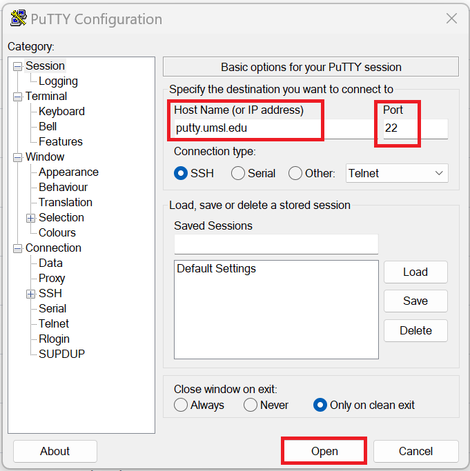
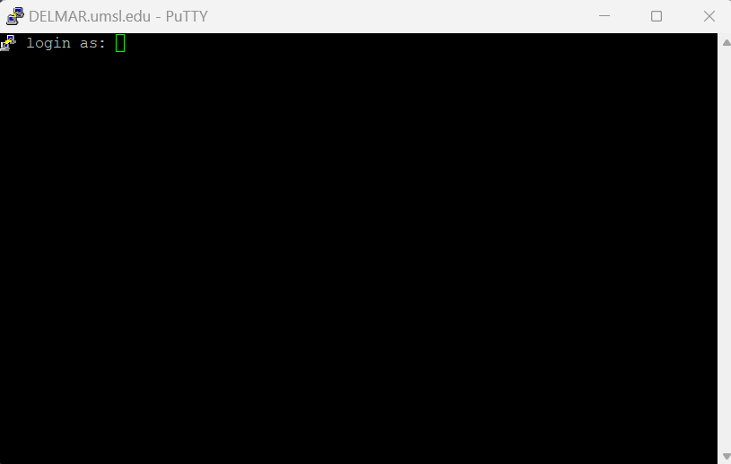
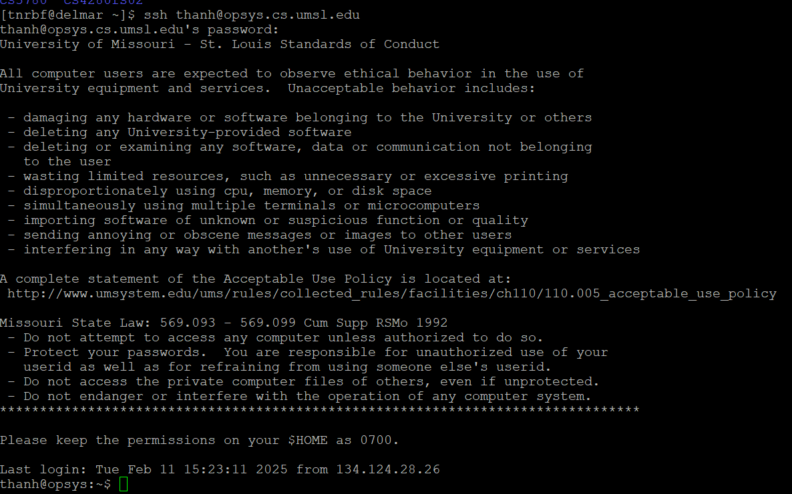

# **How to Login OPSYS System**

## I. Login into Delmar

### 1. Open PuTTY app



### 2. Input information

- Host name:

```plaintext
delmar.umsl.edu
```

- Port:

```plaintext
22
```

- Hit Open

### 3. Login to Delmar server



- At login as, types your umsl email address:

```plaintext
tnrbf@umsystem.edu
```

- At ```tnrbf@umsystem.edu@delmar.umsl.edu's password:```, enter password of umsl email

### 4. Login to opsys server

![[tnrbf@delmar ~]$](./image/opsys.png)

- At ```[tnrbf@delmar ~]$``` enter

```ssh
ssh thanh@opsys.cs.umsl.edu
```

- At ```password:``` enter

```plaintext
umsl id
```

- If success:

